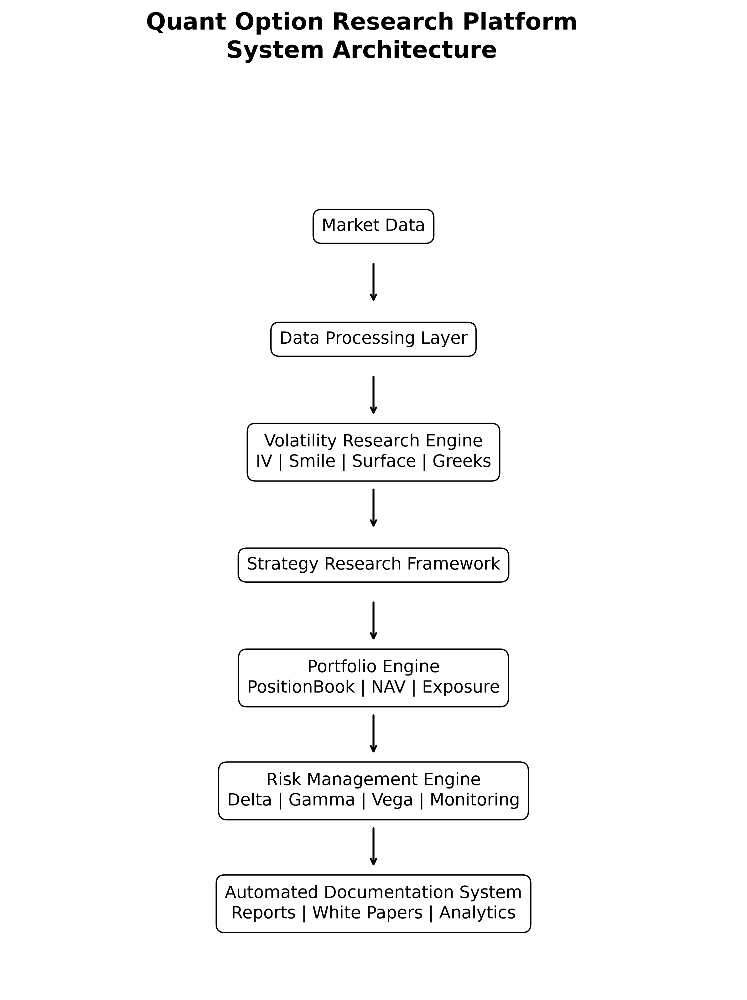
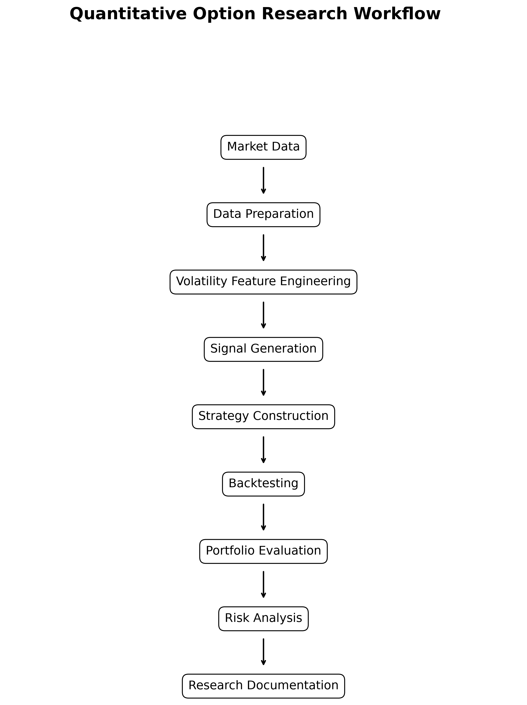
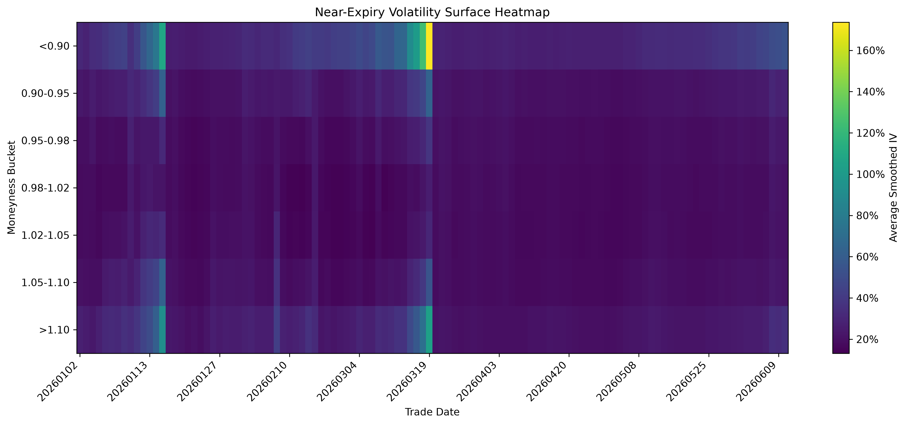
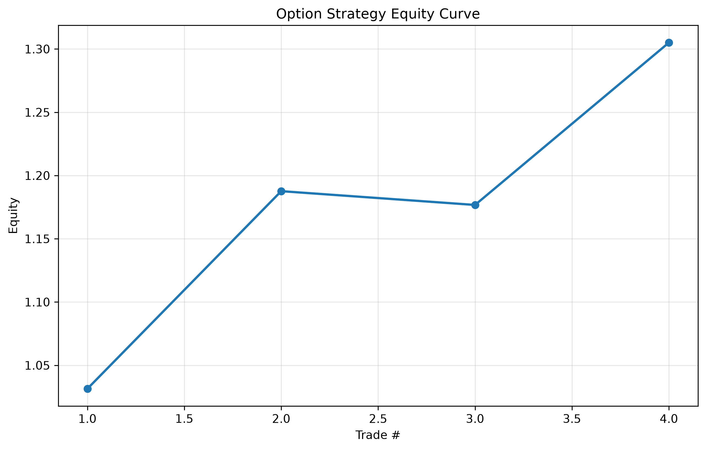
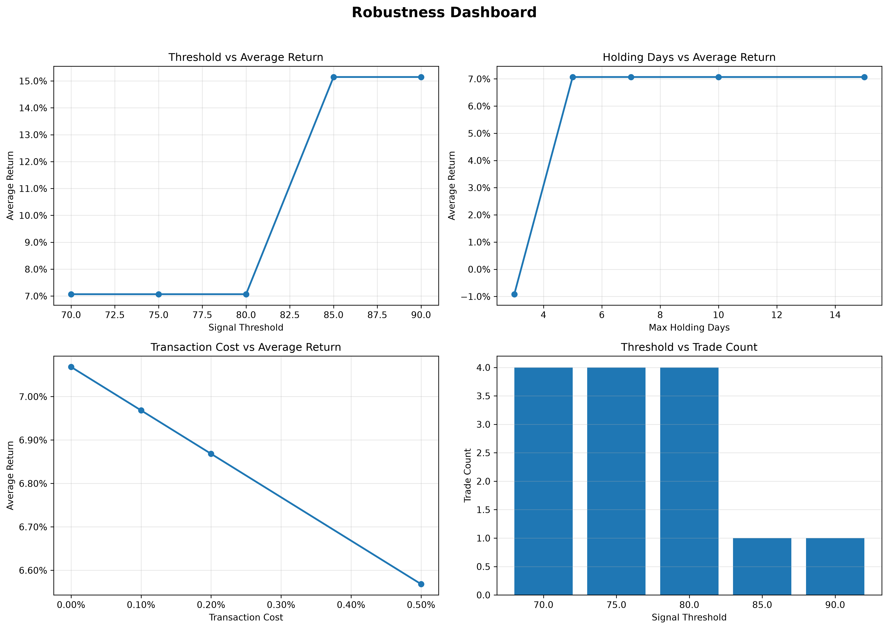

# Quant Option Research Platform



A modular quantitative options research platform integrating volatility modeling, options strategy research, portfolio analytics, risk management, and automated research documentation.

---

# Overview

The **Quant Option Research Platform** is a research-oriented quantitative framework designed to build a complete and reproducible workflow for systematic options research.

The platform connects the full quantitative research lifecycle:




The objective of this project is to bridge the gap between quantitative research prototypes and a structured research infrastructure.

The framework focuses on:

- Volatility research
- Options strategy development
- Portfolio analytics
- Risk monitoring
- Automated technical documentation


---

# Key Features


## 1. Volatility Research Engine

The volatility research module focuses on analyzing option market structures.

Main capabilities:

- Implied volatility calculation
- Volatility smile analysis
- Volatility surface construction
- Term structure analysis
- ATM volatility monitoring
- Moneyness-based volatility analysis


Research outputs include:

- IV surface visualization
- Smile evolution analysis
- Term structure monitoring
- Volatility signal generation


---

## 2. Strategy Research Framework

The strategy layer adopts a modular registry-based architecture.

Each strategy is represented through a structured research record containing:

- Strategy motivation
- Construction rules
- Entry and exit logic
- Greeks profile
- Backtest evidence
- Performance summary
- Limitations
- Future extensions


Current research strategies include:

- Volatility strategies
- Strangle structures
- Calendar spreads
- Butterfly structures


The framework allows future strategies to be added without redesigning the research infrastructure.


---

## 3. Portfolio Management Engine

The portfolio layer provides systematic portfolio analytics:

- Position tracking
- NAV calculation
- Exposure aggregation
- Portfolio Greeks calculation
- Risk snapshot generation


Core components:

- PositionBook
- Portfolio Engine
- NAV Engine


---

## 4. Risk Management Framework

The risk module evaluates portfolio exposure through option Greeks.

Covered risk measures include:

- Delta exposure
- Gamma exposure
- Vega exposure
- Portfolio risk status


The system generates:

- Exposure reports
- Risk dashboards
- Portfolio monitoring summaries


---

# Automated Research Documentation

A key feature of this project is automated technical documentation generation.

The reporting framework transforms research outputs into structured documents.

Workflow:

```
Research Data
      |
      v
Analysis Pipeline
      |
      v
Visualization Generation
      |
      v
Automated Report Builder
      |
      v
Technical Documentation
```


Generated documents include:

- English technical white paper
- Chinese technical white paper
- Strategy documentation
- Research summaries


---

# System Architecture

The project follows a modular architecture:

```
Quant Option Research Platform

|
├── Data Layer
|      Market data loading and preprocessing
|
├── Analysis Layer
|      Research analysis modules
|
├── Volatility Engine
|      IV / Smile / Surface / Term Structure
|
├── Strategy Framework
|      Strategy registry and backtesting
|
├── Portfolio Engine
|      Position and NAV management
|
├── Risk Engine
|      Greeks and exposure monitoring
|
├── Monitoring Layer
|      Risk status and reporting
|
└── Reporting Framework
       Automated documentation generation
```


---

# Selected Research Outputs


## Volatility Surface




## Portfolio Performance




## Risk Monitoring




---

# Project Structure

```
Quant-Option-Research-Platform

|
├── analysis/
|      Research analysis modules
|
├── config/
|      Configuration and research settings
|
├── framework/
|      Core quantitative research framework
|
├── scripts/
|      Research pipelines and automation scripts
|
├── docs/
|      Research design documents and figures
|
└── research/
       Reports and documentation
```


---

# Research Documentation

Complete technical documentation is available in:


## English White Paper

```
research/reports/quant_option_technical_white_paper_v3_0.docx
```


## Chinese White Paper

```
research/reports/quant_option_technical_white_paper_cn_v1_0.docx
```


The documents cover:

- Research methodology
- Volatility analysis
- Strategy framework
- Portfolio management
- Risk monitoring
- System architecture


---

# Installation


Clone the repository:

```bash
git clone https://github.com/mdldpc/Quant-Option-Research-Platform.git

cd Quant-Option-Research-Platform
```


Create a virtual environment:

```bash
python -m venv venv
```


Activate environment:

### Windows

```bash
venv\Scripts\activate
```


### Linux / macOS

```bash
source venv/bin/activate
```


Install dependencies:

```bash
pip install -r requirements.txt
```


---

# Usage


## Run Research Scripts

```bash
python scripts/<script_name>.py
```


---

## Generate Documentation


English:

```bash
python -m scripts.rebuild.build_documentation_v3_1
```


Chinese:

```bash
python -m scripts.rebuild.build_documentation_cn_v1_0
```


The pipeline automatically generates:

- Research figures
- Tables
- Technical documentation


---

# Research Workflow


```
1. Prepare Market Data

        |
        v

2. Build Research Dataset

        |
        v

3. Analyze Volatility Structure

        |
        v

4. Generate Strategy Signals

        |
        v

5. Run Backtests

        |
        v

6. Evaluate Portfolio Risk

        |
        v

7. Generate Research Report
```


---

# Future Roadmap

Potential extensions:

- Additional volatility strategies
- More comprehensive historical datasets
- Advanced portfolio optimization
- Machine learning based volatility forecasting
- Real-time market data integration
- Cloud-based research deployment


---

# License

This project is developed for quantitative research and educational purposes.