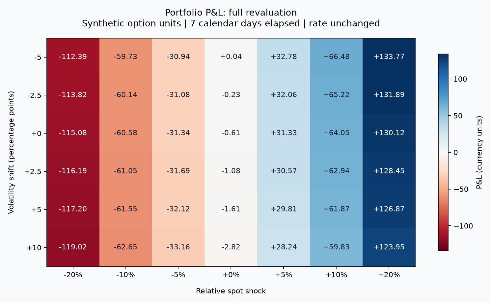
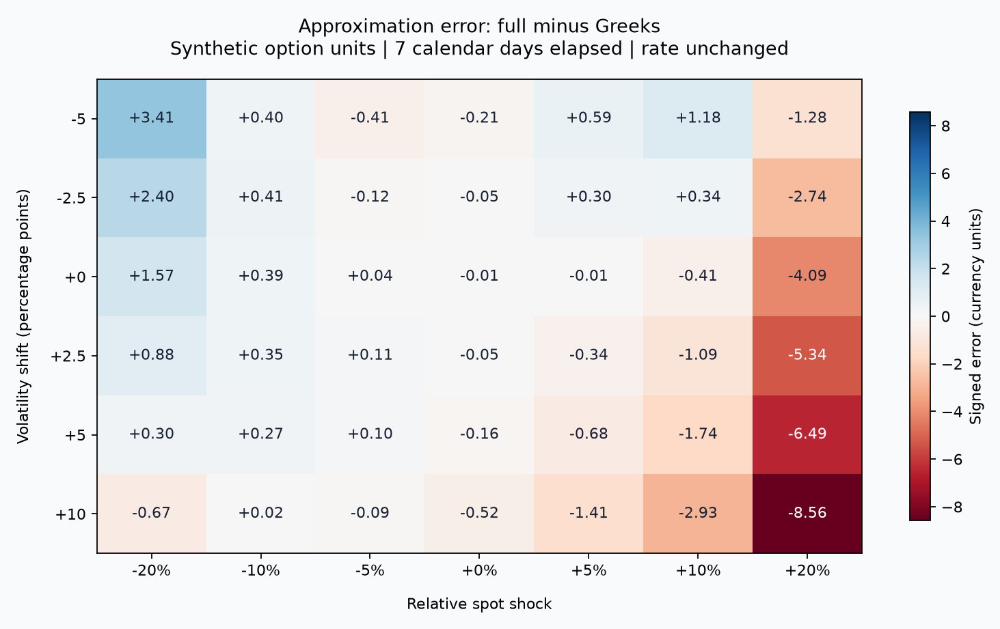

# Derivatives Valuation and Scenario Risk: Synthetic Case Study

## Executive findings

The illustrative portfolio has a net model value of **28.5420 currency units**.
A 10% spot decline, 5-percentage-point volatility increase and seven elapsed
calendar days produce a full-revaluation P&L of **-61.5491**.
The Greeks approximation gives **-61.8198**, leaving a signed
difference of **+0.2707** (full minus approximation).

The small combined shock has absolute approximation error 0.0110;
the severe downside case has error 0.6742. These measured
cases illustrate the limits of a local approximation. They do not establish an
error bound for arbitrary instruments, parameters or scenarios.

All inputs are synthetic. This is an educational, reproducible model-validation
case, not a client engagement, observed trading result or investment recommendation.

## Instrument terms and conventions

| Position ID | Quantity | Type | Strike | Maturity (years) | Volatility |
| --- | ---: | --- | ---: | ---: | ---: |
| long_call_100 | 10 | European call | 100 | 0.50 | 25% |
| short_put_95 | -6 | European put | 95 | 0.75 | 28% |
| short_call_110 | -4 | European call | 110 | 0.50 | 25% |

All options reference the same synthetic spot of 100 and a 4% continuously
compounded rate. All values share one currency. Quantities are option units;
there is no implicit 100-share or exchange contract multiplier. Negative
quantities represent short positions. Dividends are zero.

`spot_return=-0.10` means a 10% relative decline. `volatility_shift=0.05`
means an additive five-percentage-point change, not a 5% relative change.
`rate_shift=0.01` means 100 basis points. Elapsed calendar days use ACT/365.
The small combined shock is +1% spot, +0.5 volatility percentage points and
one day elapsed. Severe downside is -20% spot, +10 volatility percentage points
and seven days. Upside is +10% spot and seven days. Time-only is seven days;
rate-only is +100 basis points. Unspecified shocks are zero.

## Method and validation

Full revaluation reprices each option using Black-Scholes at the stressed
spot, volatility, rate and remaining maturity. Signed position values are
quantity times unit price; portfolio results sum position results.

The local approximation uses base-date sensitivities:

```text
P&L ≈ quantity × (Delta × dS + 0.5 × Gamma × dS²
                 + Vega × dVol + calendar-Theta × elapsedYears + Rho × dRate)
```

Theta is per calendar year; Vega and Rho are per 1.0 decimal change.
Gamma captures spot curvature. Volatility curvature, cross derivatives such
as Vanna and higher orders are omitted. Changes in volatility and time can
therefore amplify the difference from full revaluation.

Pricing is supported by the [independent valuation validation](../valuation_validation.md).
Scenario tests additionally verify quantity-weighted aggregation, no-shock and
offsetting identities, a call-minus-put replication identity, Theta/Rho finite
differences and small-shock approximation accuracy. These are implementation
checks under shared assumptions, not market calibration or external model approval.

## Scenario results

Base value: 28.5420. All table values are in currency units.

| Scenario | Stressed value | Full P&L | Approximate P&L | Full minus approximate |
| --- | ---: | ---: | ---: | ---: |
| No shock | 28.5420 | +0.0000 | +0.0000 | +0.0000 |
| Small combined shock | 34.6548 | +6.1127 | +6.1237 | -0.0110 |
| Downside with volatility rise | -33.0070 | -61.5491 | -61.8198 | +0.2707 |
| Severe downside | -90.4744 | -119.0164 | -118.3422 | -0.6742 |
| Upside | 92.5888 | +64.0468 | +64.4553 | -0.4086 |
| Time only | 27.9313 | -0.6107 | -0.6048 | -0.0059 |
| Rate only | 32.0903 | +3.5482 | +3.5673 | -0.0190 |

### Position contributions: downside with volatility rise

| Position | Base value | Stressed value | Full P&L contribution | Approximate P&L |
| --- | ---: | ---: | ---: | ---: |
| long_call_100 | 80.0800 | 43.9887 | -36.0913 | -34.8161 |
| short_put_95 | -35.2983 | -68.3606 | -33.0623 | -32.7351 |
| short_call_110 | -16.2396 | -8.6351 | +7.6045 | +5.7315 |

The put's unit price rises in this downside scenario, increasing the liability
of the short position and producing a negative P&L contribution. The short call
can offset part of the directional loss. The differing strikes and maturities
mean these positions do not form a perfect hedge.

### Approximation attribution for the downside case

| Base sensitivity term | P&L contribution |
| --- | ---: |
| Delta | -62.7139 |
| Gamma | +2.3463 |
| Vega | -0.8473 |
| Theta | -0.6048 |
| Rho | +0.0000 |

These terms sum to the approximate P&L. They are Taylor terms, not a unique
allocation of the full-revaluation P&L. The remainder is the approximation error.

## Risk maps

The 42 grid scenarios combine spot shocks from -20% to +20% with volatility
shifts from -5 to +10 percentage points; seven days elapse and rates stay fixed.





The worst grid point is `spot=-0.200;vol=+0.100` with P&L -119.0164.
The largest absolute approximation error on this grid is 8.5635.
This worst point is only the minimum of the selected grid, not a worst-case
loss bound. Scenarios have no assigned probabilities; these outputs are not VaR.

## Model limitations and practical implications

This analysis isolates option mark-to-model changes. It excludes cash balances,
premium financing, collateral, margin calls, transaction costs, dividends,
counterparty/default risk and FX translation. Negative net option value is
a signed liability, not evidence of negative total account equity.

Inputs do not model a calibrated volatility surface, stochastic volatility,
early exercise or a realized price path. The API applies common shocks to all
positions and does not infer correlations. Cross-currency inputs must not be
summed without prior conversion. All positions must remain before expiry;
at-expiry and post-expiry requests are rejected because settlement and cash
flows need a separate specification. Invalid stressed volatility is also rejected.

For large shocks, use full revaluation as the model-consistent scenario result
and the approximation as a diagnostic. Suitability of the pricing model and
market inputs requires separate assessment. The service is a research demo;
authentication, rate limiting and production operations are outside this scope.

## Reproduce and inspect

From the repository root with dependencies installed:

```powershell
python -m pytest tests -q
python -m api.scenario_example
uvicorn api.main:app --reload
```

Send `inputs.json` to POST `/risk/scenarios` or inspect `/docs` for the schema.
`results.json` contains unrounded scenario and position results. `grid_inputs.json`
and `grid_results.json` contain the exact inputs and results behind both figures.
The generator writes only this case-study directory by default and requires
no external data, credentials or network access.

## Interview discussion

- Explain signed units, volatility percentage points and the ACT/365 time basis.
- Derive why Theta has the opposite sign from the maturity derivative.
- Use the call-minus-put identity to explain an independent scenario check.
- Explain why small-shock agreement does not imply accurate large-shock hedging.
- Distinguish model implementation validation from validation against market data.
